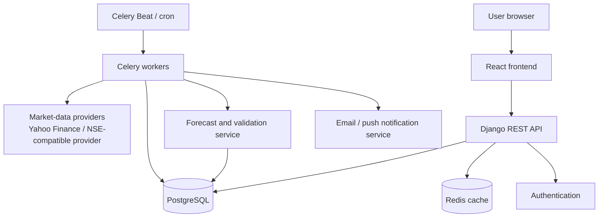

# TradeNet Documentation Index

Welcome to the TradeNet system design and architectural documentation. TradeNet is a stock research and decision-support product for Indian equities.

## Documentation Structure

- [Architecture & Data Flow](architecture.md)
  *System goals, high-level component architecture flowchart, component responsibilities, and end-to-end data flow sequence diagram.*

- [Recommended Project Structure](project-structure.md)
  *Target directory layout, modular backend apps, feature-based React frontend, and ML engine separation.*

- [Local Development Guide](running-locally.md)
  *Step-by-step instructions for running the backend, frontend, workers, and tests locally.*

- [Frontend Design](frontend-design.md)
  *React/Vite tech stack, page-by-page product overview, and template migration strategy.*

- [API Design](api-design.md)
  *REST API conventions, versioning under `/api/v1/`, and endpoint catalog.*

- [Data Model](data-model.md)
  *Entity-Relationship (ER) diagram, core database tables, immutability, and provider tracking.*

- [Prediction System](prediction-system.md)
  *Short-horizon output format, input features, walk-forward validation flowchart, and look-ahead bias prevention.*

- [Background Jobs](background-jobs.md)
  *Celery worker schedules, timing breakdown, and job idempotency rules.*

- [Security & Reliability](security-and-reliability.md)
  *Security best practices, caching, rate-limiting, failover strategies, and investment disclaimers.*

- [Deployment & Delivery Roadmap](deployment-and-roadmap.md)
  *Deployment path across services and the 7-phase product delivery roadmap.*

---

## Quick System Architecture Overview

