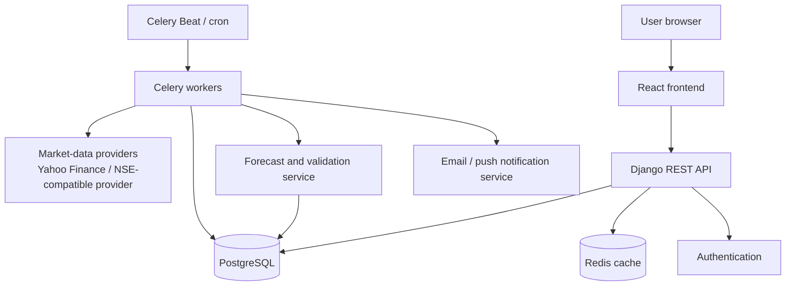
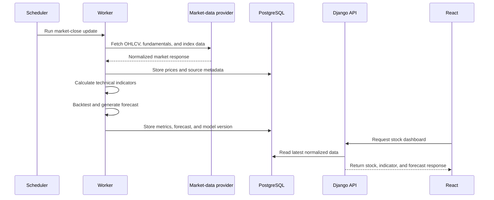

# Architecture & Core Data Flow

## Goal

TradeNet is a stock research and decision-support product for Indian equities.
It provides market data, technical and fundamental analysis, short-horizon
forecasting, watchlists, alerts, stock comparison, and portfolio insights.

It must not present forecasts as certain investment advice. Every forecast
should include its time horizon, confidence range, model version, and
performance against a simple baseline.

## High-Level System Architecture

### Component Responsibilities

| Component | Responsibility |
| --- | --- |
| React | Interactive dashboards, charts, screening, watchlists, and portfolio UI. |
| Django REST API | Authentication, validation, authorization, API responses, and business logic. |
| PostgreSQL | Durable user, market-data, indicator, forecast, and portfolio storage. |
| Redis | Cache frequently requested stock data and queue background work. |
| Celery workers | Fetch data, calculate indicators, create predictions, and send alerts. |
| Scheduler | Starts routine jobs at market-aware times. |

## End-to-End Data Flow

---
[Return to Documentation Index](README.md)
