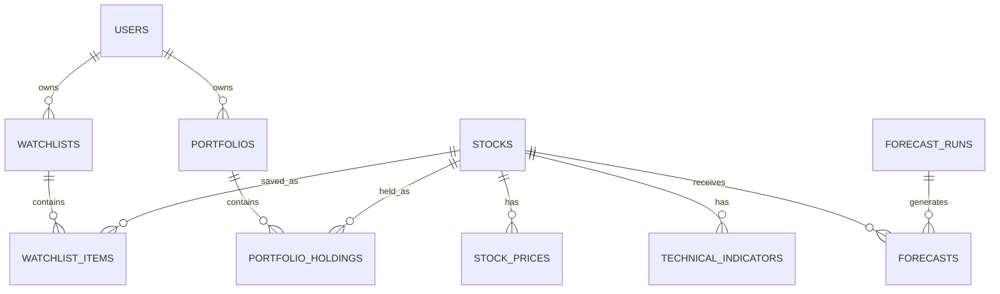

# Data Model

## Entity-Relationship Diagram



## Core Tables

```text
users
stocks
stock_prices
stock_fundamentals
technical_indicators
market_indices
sector_performance
forecast_runs
forecasts
watchlists
watchlist_items
alerts
portfolios
portfolio_holdings
transactions
news_items
```

## Data Management Guidelines

- Keep `stock_prices` immutable after ingestion when possible.
- Record provider, retrieval time, and adjustment status so forecasts can be reliably reproduced.

---
[Return to Documentation Index](README.md)
