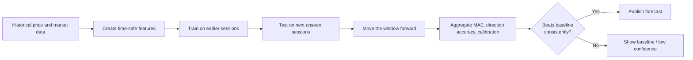

# Prediction System

## Product Output

Forecast short horizons—1, 5, and 20 trading days—rather than a single exact price far into the future. Each forecast must return:

- Probability of a positive return
- Expected return or price range
- Uncertainty interval
- Confidence label
- Prediction timestamp and model version
- Validation score beside the last-price baseline

## Inputs & Feature Engineering

- 1-, 5-, and 20-day price returns
- Moving-average distance and crossover signals
- RSI, MACD, ATR, and rolling volatility
- Volume change and unusual-volume flags
- NIFTY and sector-index returns
- *Later stage:* earnings and other event data

## Validation Process

### Preventing Look-Ahead Bias

Do not use future prices, future fundamentals, or revised data when creating a historical feature. Store every run's input range, feature version, model version, and metrics in `forecast_runs`.

---
[Return to Documentation Index](README.md)
