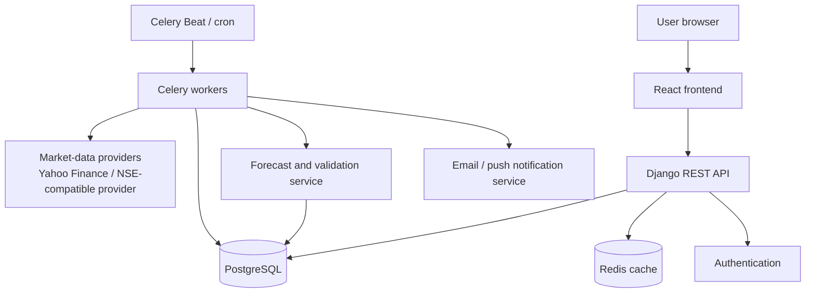
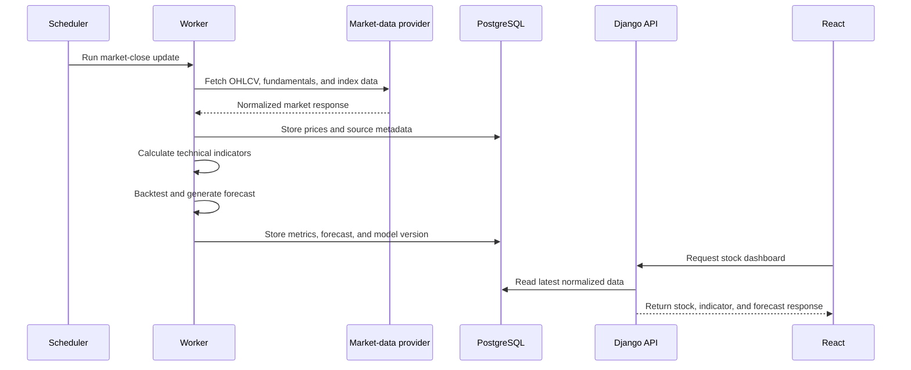
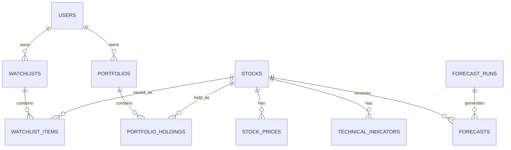
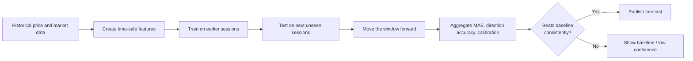

# TradeNet System Design

## Goal

TradeNet is a stock research and decision-support product for Indian equities.
It provides market data, technical and fundamental analysis, short-horizon
forecasting, watchlists, alerts, stock comparison, and portfolio insights.

It must not present forecasts as certain investment advice. Every forecast
should include its time horizon, confidence range, model version, and
performance against a simple baseline.

## Architecture



### Responsibilities

| Component | Responsibility |
| --- | --- |
| React | Interactive dashboards, charts, screening, watchlists, and portfolio UI. |
| Django REST API | Authentication, validation, authorization, API responses, and business logic. |
| PostgreSQL | Durable user, market-data, indicator, forecast, and portfolio storage. |
| Redis | Cache frequently requested stock data and queue background work. |
| Celery workers | Fetch data, calculate indicators, create predictions, and send alerts. |
| Scheduler | Starts routine jobs at market-aware times. |

## End-to-end data flow



## Frontend design

Use React, TypeScript, Vite, React Router, and TanStack Query. Keep the
current Django templates while migrating page-by-page; do not rewrite the
application in a single change.

### Product pages

| Page | Main content |
| --- | --- |
| Market overview | NIFTY/Sensex, sector heatmap, top movers, market breadth. |
| Stock detail | Price/volume chart, fundamentals, technical indicators, forecast, news. |
| Compare | Side-by-side comparison of two to four stocks. |
| Screener | Fundamental and technical filters with saved searches. |
| Watchlist | Saved stocks, notable changes, and active alerts. |
| Portfolio | Holdings, allocation, returns, concentration, and benchmark comparison. |

## API design

All new endpoints should be versioned under `/api/v1/` and return predictable
JSON. Protect user-specific endpoints with authentication.

```text
GET  /api/v1/stocks/search?q=reliance
GET  /api/v1/stocks/{symbol}
GET  /api/v1/stocks/{symbol}/history?range=1y
GET  /api/v1/stocks/{symbol}/technicals
GET  /api/v1/stocks/{symbol}/fundamentals
GET  /api/v1/stocks/{symbol}/forecast?horizon=5d
GET  /api/v1/market/overview
GET  /api/v1/market/sectors
GET  /api/v1/watchlists
POST /api/v1/watchlists
POST /api/v1/alerts
GET  /api/v1/portfolios
```

## Data model



Core tables:

```text
users
stocks
stock_prices
stock_fundamentals
technical_indicators
market_indices
sector_performance
forecast_runs
forecasts
watchlists
watchlist_items
alerts
portfolios
portfolio_holdings
transactions
news_items
```

Keep `stock_prices` immutable after ingestion when possible. Record provider,
retrieval time, and adjustment status so forecasts can be reproduced.

## Prediction system

### Product output

Forecast short horizons—1, 5, and 20 trading days—rather than a single exact
price far into the future. Return:

- probability of a positive return;
- expected return or price range;
- uncertainty interval;
- confidence label;
- prediction timestamp and model version;
- validation score beside the last-price baseline.

### Inputs

- 1-, 5-, and 20-day price returns;
- moving-average distance and crossover signals;
- RSI, MACD, ATR, and rolling volatility;
- volume change and unusual-volume flags;
- NIFTY and sector-index returns;
- later: earnings and other event data.

### Validation process



Do not use future prices, future fundamentals, or revised data when creating a
historical feature. This avoids look-ahead bias. Store every run's input range,
feature version, model version, and metrics in `forecast_runs`.

## Background jobs

| Timing | Job |
| --- | --- |
| During market hours | Refresh quotes at an appropriate provider-supported interval. |
| After market close | Ingest final OHLCV data and calculate indicators. |
| After indicators | Run walk-forward evaluation and produce forecasts. |
| Daily/weekly | Refresh fundamentals, index constituents, and sector mappings. |
| Periodically | Evaluate alert rules and send notifications. |

Jobs should be idempotent: rerunning a job for the same symbol and date must
update or safely skip the same record rather than create duplicates.

## Security and reliability

- Use environment variables for provider credentials and Django secrets.
- Rate-limit public API endpoints and cache popular stock requests.
- Validate symbols and user inputs; authorize every portfolio/watchlist action.
- Log provider failures and display when data was last refreshed.
- Use database constraints for unique `(symbol, date)` price records.
- Back up PostgreSQL and monitor failed worker jobs.
- Add a clear educational disclaimer; forecasts are not investment advice.

## Deployment path

Start with a Django API, PostgreSQL, Redis, and Celery worker on the same
hosting provider. Deploy React separately as a static site or serve its built
assets from Django during the migration. As load grows, move workers and the
prediction service to independent processes.

## Delivery roadmap

1. Add Django REST Framework endpoints and migrate the stock-detail page to React.
2. Make historical data, search, charts, and technical indicators reliable.
3. Add short-horizon, walk-forward-validated forecasts with transparent metrics.
4. Add watchlists and alerts.
5. Add comparison and screeners.
6. Add portfolio tracking.
7. Add news/event data after the core market data is dependable.
